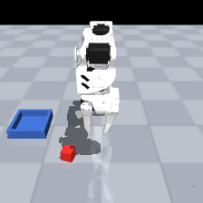

# TalkToTheCell — language-conditioned manipulation with SmolVLA

**Project B of the Sim2Cell portfolio:** fine-tune **SmolVLA (450M)**, a
vision-language-action model, on the author's own
[`so101-sim-pickplace`](https://huggingface.co/datasets/ahmedsohail2003/so101-sim-pickplace)
dataset — 100 language-labeled MuJoCo demonstrations of an SO-ARM100 arm
executing *"Pick up the red block and place it in the blue tray."* — and
compare it against the ACT baseline trained on the same data (65%, 75% with
temporal ensembling).

Where [sim2cell](../sim2cell) asks *"can a policy copy the expert from
pixels?"*, this project asks *"can a **foundation model** be steered to the
same task with natural language?"* — the paradigm industrial robotics is
converging on for taskable, reconfigurable cells.

## Results

20 evaluation episodes in the MuJoCo work-cell — fixed eval seed disjoint from
training, nominal scene, 240-step cap, **identical protocol for every row**:

| Policy | Success | Notes |
|---|---|---|
| SmolVLA base, zero-shot | 0/20 (0%) | never engages the block |
| **SmolVLA fine-tuned (12k steps, this project)** | **11/20 (55%)** | every success ≈105 steps, tray placement ±3 mm |
| ACT (~52M specialist BC, same 100 demos) | 13/20 (65%) | sim2cell baseline |
| ACT + temporal ensembling | 15/20 (75%) | |

**The story:** 12k steps of expert-only fine-tuning on a single free-tier T4
takes a generalist VLA from 0% to within 10 points of a specialist
behavior-cloning baseline trained on the same 100 demonstrations — while being
commandable in natural language. Failure analysis: the fine-tuned policy either
commits and succeeds with remarkable consistency (105±1 steps, ±3 mm placement)
or never engages at all; the non-engagements cluster on right-side block spawns,
which are under-represented in the demos. The fix would be data, not model:
record more right-side episodes (or train on the 160-episode `-v2` set).

Model + card: [`ahmedsohail2003/smolvla-so101-pickplace`](https://huggingface.co/ahmedsohail2003/smolvla-so101-pickplace) ·
Reproduce: [`notebooks/kaggle_smolvla_finetune.ipynb`](notebooks/kaggle_smolvla_finetune.ipynb) (train) +
[`scripts/eval_smolvla.py`](scripts/eval_smolvla.py) (eval; `--repo lerobot/smolvla_base` for the zero-shot row)

## Status

| Step | State |
|---|---|
| Dataset published to the Hub (with card) | ✅ [`so101-sim-pickplace`](https://huggingface.co/datasets/ahmedsohail2003/so101-sim-pickplace) |
| Kaggle fine-tune notebook | ✅ [`notebooks/kaggle_smolvla_finetune.ipynb`](notebooks/kaggle_smolvla_finetune.ipynb) |
| Training run (Kaggle T4 ×1, 12k steps, ~8 h) | ✅ loss 0.97 → 0.06 |
| Model on the Hub + model card | ✅ [`smolvla-so101-pickplace`](https://huggingface.co/ahmedsohail2003/smolvla-so101-pickplace) |
| Local sim evaluation vs ACT baseline | ✅ 55% vs 65/75% (table above) |
| Demo GIF | ✅ `outputs/smolvla_episode.gif` (also on the model card) |

## Free-tier engineering

SmolVLA full fine-tuning wants ~24 GB VRAM; the free-tier recipe that fits a
16 GB T4:

- **Frozen VLM backbone** — LeRobot's SmolVLA defaults (`freeze_vision_encoder=True`,
  `train_expert_only=True`) train only the ~100M-parameter action expert
- **AMP (fp16)** + batch 8 (vs the paper's batch 64 on A100)
- 20k steps with checkpoints every 5k → survives Kaggle's 12 h session cap,
  resumable via `--resume=true`

## License

Apache-2.0
