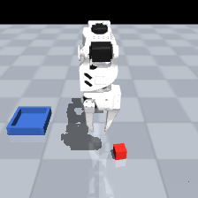

# WorkCell Part B — TalkToTheCell: language-conditioned manipulation with SmolVLA

> **Part B of the _WorkCell_ series** — one simulated industrial work-cell, five learning approaches:
> [A · imitation](https://github.com/ahmedsohail2003/workcell-partA-imitation) ·
> [B · VLA](https://github.com/ahmedsohail2003/workcell-partB-vla) ·
> [C · grasping](https://github.com/ahmedsohail2003/workcell-partC-grasping) ·
> [D · RL + world model](https://github.com/ahmedsohail2003/workcell-partD-rl) ·
> [E · ROS 2](https://github.com/ahmedsohail2003/workcell-partE-ros2) ·
> [datasets & models on 🤗](https://huggingface.co/ahmedsohail2003) ·
> **[🌐 portfolio overview](https://ahmedsohail2003.github.io/)** — the whole series on one page

**Project B of the Sim2Cell portfolio:** fine-tune **SmolVLA (450M)**, a
vision-language-action model, on the author's own
[`so101-sim-pickplace`](https://huggingface.co/datasets/ahmedsohail2003/so101-sim-pickplace)
dataset — 100 language-labeled MuJoCo demonstrations of an SO-ARM100 arm
executing *"Pick up the red block and place it in the blue tray."* — and
compare it against the ACT baseline trained on the same data (65%, 75% with
temporal ensembling).

Where [Part A · Sim2Cell](https://github.com/ahmedsohail2003/workcell-partA-imitation) asks *"can a policy copy the expert from
pixels?"*, this project asks *"can a **foundation model** be steered to the
same task with natural language?"* — the paradigm industrial robotics is
converging on for taskable, reconfigurable cells.

## Results

20 evaluation episodes in the MuJoCo work-cell — fixed eval seed disjoint from
training, nominal scene, 240-step cap, **identical protocol for every row**:

| Policy | Success | Notes |
|---|---|---|
| SmolVLA base, zero-shot | 0/20 (0%) | never engages the block |
| SmolVLA + 100 nominal demos (v1) | 11/20 (55%) | all failures = right-side non-engagements (coverage) |
| **SmolVLA + 160-ep `-v2` recovery set** | **18/20 (90%)** | coverage fixed; one success is a live miss→retry→recover (165 steps) |
| ACT (~52M specialist BC, 100 nominal demos) | 13/20 (65%) | sim2cell baseline |
| ACT + temporal ensembling | 15/20 (75%) | |
| ACT trained on the same `-v2` set | 10/20 (50%) | *hurt* by the identical data — see below |

**Arc of the project:** a generalist VLA goes 0% → 55% with 12k fine-tune steps
on 100 demos (single free-tier T4), failure analysis shows a right-side
coverage gap, and retraining on the 160-episode recovery set closes it:
**0% → 55% → 90%**, language-conditioned throughout, tying the best specialist
policy in the portfolio ([ACT-DR](https://huggingface.co/ahmedsohail2003/act-so101-pickplace-dr), 90%).

**The cross-architecture finding (the headline):** the identical `-v2` dataset
moved the two architectures in opposite directions — ACT (chunked L1
regression) fell 65% → 50% because recovery demos make the data behaviorally
multimodal and chunk averaging blends incompatible proceed-vs-retry
continuations; SmolVLA's **flow-matching action expert** simply learns both
modes and rose 55% → 90%. Same data, opposite outcomes, mechanism confirmed
from both sides — architecture determines whether behavioral diversity is
signal or poison. (ACT side documented as a
[negative-result model card](https://huggingface.co/ahmedsohail2003/act-so101-pickplace-v2).)

Models + cards: [v1 (55%)](https://huggingface.co/ahmedsohail2003/smolvla-so101-pickplace) ·
[**v2 (90%)**](https://huggingface.co/ahmedsohail2003/smolvla-so101-pickplace-v2) ·
Reproduce: [`notebooks/kaggle_smolvla_finetune.ipynb`](notebooks/kaggle_smolvla_finetune.ipynb) (parameterized) +
[`scripts/eval_smolvla.py`](scripts/eval_smolvla.py) (`--repo` selects the model; `lerobot/smolvla_base` for the zero-shot row)

## Status

| Step | State |
|---|---|
| Dataset published to the Hub (with card) | ✅ [`so101-sim-pickplace`](https://huggingface.co/datasets/ahmedsohail2003/so101-sim-pickplace) |
| Kaggle fine-tune notebook | ✅ [`notebooks/kaggle_smolvla_finetune.ipynb`](notebooks/kaggle_smolvla_finetune.ipynb) |
| Training run (Kaggle T4 ×1, 12k steps, ~8 h) | ✅ loss 0.97 → 0.06 |
| Model on the Hub + model card | ✅ [`smolvla-so101-pickplace`](https://huggingface.co/ahmedsohail2003/smolvla-so101-pickplace) |
| Local sim evaluation vs ACT baseline | ✅ v1 55% → **v2 90%** (table above) |
| Demo GIFs | ✅ `outputs/smolvla_episode.gif` (v1), `outputs/smolvla_v2_episode.gif` (v2, on the v2 card) |
| Cross-architecture data study (vs ACT on `-v2`) | ✅ same data: ACT −15, SmolVLA +35 |

## Free-tier engineering

SmolVLA full fine-tuning wants ~24 GB VRAM; the free-tier recipe that fits a
16 GB T4:

- **Frozen VLM backbone** — LeRobot's SmolVLA defaults (`freeze_vision_encoder=True`,
  `train_expert_only=True`) train only the ~100M-parameter action expert
- **AMP (fp16)** + batch 8 (vs the paper's batch 64 on A100)
- 20k steps with checkpoints every 5k → survives Kaggle's 12 h session cap,
  resumable via `--resume=true`

## License

Apache-2.0
